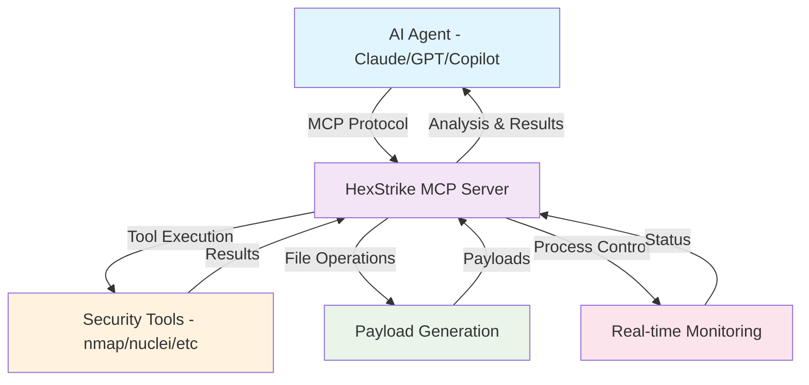

<div align="center">

# HexStrike AI MCP Agents v5.0
### AI-Powered Cybersecurity Tool Integration via Model Context Protocol

[](https://www.python.org/)
[](LICENSE)
[](https://github.com/0x4m4/hexstrike-ai)
[](https://github.com/0x4m4/hexstrike-ai)
[](https://github.com/0x4m4/hexstrike-ai/releases)
[](https://github.com/0x4m4/hexstrike-ai)

**MCP Server that enables AI agents to perform autonomous cybersecurity testing and penetration testing through 70+ integrated security tools**

[🚀 Quick Start](#-quick-installation) • [📚 Documentation](#-architecture-overview) • [🛠️ Features](#-comprehensive-feature-set) • [💡 Examples](#-ai-agent-usage-examples) • [🤝 Contributing](#-contributing) • [⭐ Star Us](https://github.com/0x4m4/hexstrike-ai)

</div>

---

## 🏗️ **Architecture Overview**

HexStrike AI MCP Agents is a **Model Context Protocol (MCP) server** that bridges AI agents with cybersecurity tools. This project serves as the foundation for HexStrike AI - a separate automated AI pentesting platform.



### **How It Works:**
1. **AI Agent Connection**: Claude, GPT, or other MCP-compatible AI agents connect to this server
2. **Intelligent Tool Usage**: AI agents autonomously select and execute appropriate security tools
3. **Real-time Results**: Agents receive live feedback and adapt their testing strategies
4. **Autonomous Pentesting**: AI performs comprehensive security assessments without human intervention

*Note: Some components of this project are integrated into the main HexStrike AI automated pentesting platform.*

---

## **Why Choose HexStrike AI MCP Agents?**

Enable your AI agents to become autonomous cybersecurity experts with access to professional-grade security tools and intelligent automation capabilities.

### 🎯 **Perfect For:**
- 🤖 **AI Agent Developers** - Provide your agents with cybersecurity capabilities
- 🔍 **Automated Penetration Testing** - Let AI agents perform comprehensive security assessments
- 💰 **Bug Bounty Automation** - AI-driven target analysis and vulnerability discovery
- 🏆 **CTF Automation** - AI agents that can solve security challenges
- 🔬 **Security Research** - Automated tool orchestration and payload generation
- 📚 **Security Training** - AI tutors with practical security tool access

---

## **Key Highlights**

<div align="center">

| 🤖 **AI Agent Integration** | 🛠️ **70+ Security Tools** | ⚡ **Real-time Control** |
|:---:|:---:|:---:|
| MCP protocol for seamless AI connection | Complete penetration testing toolkit | Command termination & progress tracking |

| 🔧 **Intelligent Automation** | 🌐 **Modern API Testing** | 📊 **Advanced Monitoring** |
|:---:|:---:|:---:|
| AI-driven tool selection & usage | GraphQL, JWT, REST API security | Live dashboards & system metrics |

</div>

### ✨ **What Makes Us Special:**

- 🔥 **Zero Human Intervention** - AI agents handle complete security assessments
- 🎨 **Beautiful Real-time Output** - Progress bars, ETA calculations, visual status
- 🧠 **Intelligent Tool Selection** - AI chooses the right tools for each scenario
- 📊 **Live Dashboard** - Monitor all AI agent activities with system metrics
- 🔄 **Smart Caching** - Optimized performance for repeated operations
- 🛡️ **Comprehensive Coverage** - Network, web, binary, cloud, CTF tools

---

## **Comprehensive Feature Set**

### 🎯 **Core Security Tools (70+)**

<details>
<summary><b>🔍 Network Reconnaissance & Scanning</b></summary>

- **Nmap** - Advanced port scanning with custom NSE scripts
- **Amass** - Comprehensive subdomain enumeration and OSINT
- **Subfinder** - Fast passive subdomain discovery
- **Nuclei** - Fast vulnerability scanner with 4000+ templates
- **AutoRecon** - Automated reconnaissance with 35+ parameters
- **Fierce** - DNS reconnaissance and zone transfer testing
- **Masscan** - High-speed Internet-scale port scanner

</details>

<details>
<summary><b>🌐 Web Application Security Testing</b></summary>

- **Gobuster** - Directory, file, and DNS enumeration
- **FFuf** - Fast web fuzzer with advanced filtering capabilities
- **Dirb** - Comprehensive web content scanner
- **Nikto** - Web server vulnerability scanner
- **SQLMap** - Advanced automatic SQL injection testing
- **WPScan** - WordPress security scanner with vulnerability database
- **Burp Suite** - Professional web security testing platform
- **OWASP ZAP** - Web application security scanner
- **Arjun** - HTTP parameter discovery tool
- **Wafw00f** - Web application firewall fingerprinting
- **Feroxbuster** - Fast content discovery tool
- **Dotdotpwn** - Directory traversal fuzzer
- **XSSer** - Cross-site scripting detection and exploitation
- **Wfuzz** - Web application fuzzer

</details>

<details>
<summary><b>🔐 Authentication & Password Security</b></summary>

- **Hydra** - Network login cracker supporting 50+ protocols
- **John the Ripper** - Advanced password hash cracking
- **Hashcat** - World's fastest password recovery tool
- **Medusa** - Speedy, parallel, modular login brute-forcer
- **Patator** - Multi-purpose brute-forcer
- **CrackMapExec** - Swiss army knife for pentesting networks
- **Evil-WinRM** - Windows Remote Management shell

</details>

<details>
<summary><b>🔬 Binary Analysis & Reverse Engineering</b></summary>

- **GDB** - GNU Debugger with Python scripting
- **Radare2** - Advanced reverse engineering framework
- **Binwalk** - Firmware analysis and extraction tool
- **ROPgadget** - ROP/JOP gadget finder
- **Checksec** - Binary security property checker
- **Strings** - Extract printable strings from binaries
- **Objdump** - Display object file information
- **Ghidra** - NSA's software reverse engineering suite
- **XXD** - Hex dump utility

</details>

<details>
<summary><b>🏆 Advanced CTF & Forensics Tools</b></summary>

- **Volatility3** - Advanced memory forensics framework
- **Foremost** - File carving and data recovery
- **Steghide** - Steganography detection and extraction
- **ExifTool** - Metadata reader/writer for various file formats
- **HashPump** - Hash length extension attack tool
- **Binwalk** - Firmware analysis and reverse engineering
- **Autopsy** - Digital forensics platform
- **Sleuth Kit** - Collection of command-line digital forensics tools

</details>

<details>
<summary><b>☁️ Cloud & Container Security</b></summary>

- **Prowler** - AWS/Azure/GCP security assessment tool
- **Trivy** - Comprehensive vulnerability scanner for containers
- **Scout Suite** - Multi-cloud security auditing tool
- **Kube-Hunter** - Kubernetes penetration testing tool
- **Kube-Bench** - CIS Kubernetes benchmark checker
- **CloudSploit** - Cloud security scanning and monitoring

</details>

<details>
<summary><b>🔥 Bug Bounty & Reconnaissance Arsenal</b></summary>

- **Hakrawler** - Fast web endpoint discovery and crawling
- **HTTPx** - Fast and multi-purpose HTTP toolkit
- **ParamSpider** - Mining parameters from dark corners of web archives
- **Aquatone** - Visual inspection of websites across hosts
- **Subjack** - Subdomain takeover vulnerability checker
- **DNSENUM** - DNS enumeration script
- **Fierce** - Domain scanner for locating targets

</details>

### 🤖 **AI-Powered Automation Features**

<details>
<summary><b>🎯 Intelligent Payload Generation</b></summary>

**Smart Attack Vector Creation:**
- **XSS Payloads** - Basic, advanced, filter bypass techniques
- **SQL Injection** - Database-specific, blind, time-based attacks
- **Command Injection** - OS-specific, blind execution techniques
- **LFI/RFI** - Local/remote file inclusion with wrapper techniques
- **SSTI** - Server-side template injection for various engines
- **XXE** - XML external entity attacks with data exfiltration
- **CSRF** - Cross-site request forgery payload generation

**Features:**
- 🧠 **Context Awareness** - AI adapts payloads to target technology
- 🎯 **Risk Assessment** - Automatic payload severity rating
- 🔄 **Encoding Variations** - URL, HTML, Unicode encoding
- 📊 **Success Probability** - AI-calculated effectiveness scores

</details>

<details>
<summary><b>🧪 Automated Vulnerability Testing</b></summary>

- **Intelligent Test Cases** - AI-guided vulnerability assessment
- **Response Analysis** - Automated vulnerability confirmation
- **False Positive Reduction** - Smart filtering and validation
- **Comprehensive Reports** - Detailed security assessments
- **Attack Chaining** - Multi-stage exploit development

</details>

<details>
<summary><b>🌐 Advanced API Security Testing</b></summary>

- **GraphQL Security** - Introspection, depth limiting, batch query testing
- **JWT Analysis** - Algorithm confusion, signature bypass, token manipulation
- **REST API Testing** - Endpoint discovery, parameter fuzzing, authentication bypass
- **API Schema Analysis** - OpenAPI/Swagger security assessment
- **Comprehensive Audits** - Multi-technique API penetration testing

</details>

### ⚡ **Performance & Control Features**

<details>
<summary><b>🎮 Real-time Process Management</b></summary>

**Advanced Command Control:**
- **Live Termination** - Stop scans without server restart
- **Progress Tracking** - Real-time progress bars with ETA calculations
- **Process Dashboard** - Monitor all active scans simultaneously
- **Resource Management** - CPU and memory optimization
- **Pause/Resume** - Full control over long-running operations

**Visual Progress Display:**
```bash
⚡ PROGRESS ⣷ [████████████░░░░░░░░] 60.5% | 12.3s | ETA: 8s | PID: 87369
📊 FINAL RESULTS ✅
   ├─ Command: nmap -sV -sC example.com
   ├─ Duration: 15.2s
   ├─ Output Size: 2847 bytes
   ├─ Exit Code: 0
   └─ Status: SUCCESS | Cached: Yes
```

</details>

<details>
<summary><b>🚀 Intelligent Caching System</b></summary>

- **Performance Optimization** - Smart result caching with LRU eviction
- **Context-Aware TTL** - Dynamic cache expiration based on command type
- **Hit Rate Optimization** - Statistical analysis and cache tuning
- **Memory Management** - Configurable cache size and cleanup
- **Cache Analytics** - Detailed performance metrics

</details>

---

## **Quick Installation**

### 📋 **System Requirements**

```bash
# Recommended Environment
OS: Kali Linux 2023.1+ / Ubuntu 20.04+ / Debian 11+
Python: 3.8+ with pip
RAM: 4GB+ (8GB recommended)
Storage: 20GB+ free space
Network: High-speed internet for tool updates
```

### 🛠️ **Installation Steps**

#### **Step 1: Install Server Dependencies**

```bash
# 1. Clone the repository
git clone https://github.com/0x4m4/hexstrike-ai.git
cd hexstrike-ai

# 2. Install Python dependencies
pip3 install -r requirements.txt
```

#### **Step 2: Install Security Tools**

**Required Tools** (install separately from their respective sources):
- **Network Tools**: nmap, amass, subfinder, nuclei, autorecon, fierce, masscan
- **Web Tools**: gobuster, ffuf, dirb, nikto, sqlmap, wpscan, burpsuite, zaproxy
- **Password Tools**: hydra, john, hashcat, medusa, patator, crackmapexec
- **Binary Tools**: gdb, radare2, binwalk, ropgadget, checksec, ghidra
- **Forensics Tools**: volatility3, foremost, steghide, exiftool, hashpump
- **Cloud Tools**: prowler, trivy, scout-suite, kube-hunter, kube-bench
- **Recon Tools**: hakrawler, httpx, paramspider, aquatone, subjack, dnsenum

*Note: Each tool should be installed according to its official documentation.*

#### **Step 3: Start HexStrike Server**

```bash
# Start the MCP server
python3 hexstrike_server.py

# Verify server is running
curl http://localhost:5000/health
```

#### **Step 4: Configure AI Agent**

Use the provided MCP configuration file [`hexstrike-ai-mcp.json`](hexstrike-ai-mcp.json) with your AI agent.

---

## **AI Integration Setup**

### **Claude Desktop Integration**

<details>
<summary><b>Claude MCP Configuration</b></summary>

**Configure Claude Desktop:**
Edit `~/.config/Claude/claude_desktop_config.json`:
```json
{
  "mcpServers": {
    "hexstrike-ai": {
      "command": "python3",
      "args": [
        "/path/to/hexstrike-ai/hexstrike_mcp.py",
        "--server", "http://localhost:5000"
      ],
      "env": {
        "HEXSTRIKE_SERVER": "http://localhost:5000"
      }
    }
  }
}
```

</details>

### **VS Code Copilot Integration**

<details>
<summary><b>VS Code MCP Configuration</b></summary>

**Configure VS Code settings** in `.vscode/settings.json`:
```json
{
  "mcp.servers": {
    "hexstrike-ai": {
      "command": "python3",
      "args": [
        "/path/to/hexstrike-ai/hexstrike_mcp.py",
        "--server", "http://localhost:5000"
      ],
      "description": "HexStrike AI MCP Agents v5.0"
    }
  }
}
```

</details>

### **Cursor AI Integration**

<details>
<summary><b>Cursor MCP Setup Guide</b></summary>

**Configure Cursor settings** in `~/.cursor/mcp_settings.json`:
```json
{
  "mcpServers": {
    "hexstrike-ai": {
      "command": "python3",
      "args": [
        "/path/to/hexstrike-ai/hexstrike_mcp.py",
        "--server", "http://localhost:5000"
      ],
      "description": "HexStrike AI MCP Agents v5.0"
    }
  }
}
```

</details>

---

## **AI Agent Usage Examples**

### 🎯 **Example AI Conversations**

#### **Autonomous Penetration Testing**
```
User: "Perform a comprehensive security assessment of example.com"

AI Agent: "I'll conduct a multi-phase security assessment:
1. Starting with network reconnaissance using nmap...
2. Performing subdomain enumeration with amass...
3. Running web application scans with nuclei...
4. Testing for common vulnerabilities...

[Real-time results and analysis follow]"
```

#### **Intelligent Vulnerability Discovery**
```
User: "Find XSS vulnerabilities in this web application"

AI Agent: "I'll test for XSS vulnerabilities:
1. Crawling the application with hakrawler...
2. Discovering parameters with paramspider...
3. Generating contextual XSS payloads...
4. Testing each injection point...

[Detailed vulnerability report with proof-of-concepts]"
```

#### **Advanced API Security Testing**
```
User: "Audit this GraphQL API for security issues"

AI Agent: "I'll perform a comprehensive GraphQL security audit:
1. Testing introspection queries...
2. Analyzing query depth limitations...
3. Checking for batch query vulnerabilities...
4. Examining authentication bypass techniques...

[Complete API security assessment with recommendations]"
```

*Video demonstrations and screenshots showing AI agents in action will be added here.*

---

## **API Reference**

### 🔧 **Core System Endpoints**

| Endpoint | Method | Description | Parameters |
|----------|--------|-------------|------------|
| `/health` | GET | Server health check | None |
| `/api/command` | POST | Execute arbitrary commands | `command`, `use_cache` |
| `/api/telemetry` | GET | System performance metrics | None |
| `/api/cache/stats` | GET | Cache performance statistics | None |

### 🛡️ **Security Tools API**

<details>
<summary><b>Network Security Tools</b></summary>

| Tool | Endpoint | Key Parameters |
|------|----------|---------------|
| **Nmap** | `/api/tools/nmap` | `target`, `scan_type`, `ports`, `additional_args` |
| **Amass** | `/api/tools/amass` | `domain`, `mode`, `additional_args` |
| **Subfinder** | `/api/tools/subfinder` | `domain`, `silent`, `additional_args` |
| **Nuclei** | `/api/tools/nuclei` | `target`, `severity`, `additional_args` |

</details>

### 🤖 **AI-Powered Features**

<details>
<summary><b>Intelligent Security Testing</b></summary>

| Feature | Endpoint | Key Parameters |
|---------|----------|---------------|
| **Payload Generation** | `/api/ai/generate_payload` | `attack_type`, `complexity`, `technology` |
| **Payload Testing** | `/api/ai/test_payload` | `payload`, `target_url`, `method` |
| **Attack Suite** | `/api/ai/generate_attack_suite` | `target_url`, `attack_types` |

</details>

### 🎮 **Process Management**

<details>
<summary><b>Real-time Command Control</b></summary>

| Action | Endpoint | Description |
|--------|----------|-------------|
| **List Processes** | `GET /api/processes/list` | List all active processes |
| **Process Status** | `GET /api/processes/status/<pid>` | Get detailed process information |
| **Terminate** | `POST /api/processes/terminate/<pid>` | Stop specific process |
| **Dashboard** | `GET /api/processes/dashboard` | Live monitoring dashboard |

</details>

---

## **Troubleshooting**

### Common Issues

1. **MCP Connection Failed**:
   ```bash
   # Check if server is running
   netstat -tlnp | grep 5000
   
   # Restart server
   python3 hexstrike_server.py
   ```

2. **Security Tools Not Found**:
   ```bash
   # Check tool availability
   which nmap gobuster nuclei
   
   # Install missing tools from their official sources
   ```

3. **AI Agent Cannot Connect**:
   ```bash
   # Verify MCP configuration paths
   # Check server logs for connection attempts
   python3 hexstrike_mcp.py --debug
   ```

### Debug Mode
Enable debug mode for detailed logging:
```bash
python3 hexstrike_server.py --debug
python3 hexstrike_mcp.py --debug
```

---

## **Performance Features**

- **⚡ Result Caching**: Optimized performance for repeated operations
- **🔄 Concurrent Execution**: Multiple tools can run simultaneously
- **📊 Real-time Progress**: Live command output and progress tracking
- **💾 Memory Optimization**: Efficient handling of large outputs
- **🔧 Automatic Cleanup**: Temporary files and processes are managed

---

## **What's New in v5.0**

### 🔥 Major Enhancements
- **MCP Integration**: Full Model Context Protocol support for AI agents
- **Advanced Process Control**: Real-time command termination and monitoring
- **Enhanced Caching**: LRU cache with intelligent TTL management
- **Cloud Security**: Comprehensive cloud and container security tools
- **AI Automation**: Intelligent payload generation and testing capabilities
- **File Operations**: Complete file management system for AI agents

### 🆕 New Features
- Real-time command output streaming
- Progress indicators for long-running operations
- Contextual payload generation system
- Advanced API security testing (GraphQL, JWT)
- Comprehensive process dashboard
- Enhanced error handling with detailed logging

---

## 🔒 Security Considerations

⚠️ **Important Security Notes**:
- This tool provides AI agents with powerful system access
- Run in isolated environments or dedicated security testing VMs
- AI agents can execute arbitrary security tools - ensure proper oversight
- Monitor AI agent activities through the real-time dashboard
- Consider implementing authentication for production deployments

---

## 📝 Contributing

We welcome contributions from the cybersecurity and AI community!

### 🔧 **Development Environment Setup**

```bash
# 1. Fork and clone the repository
git clone https://github.com/0x4m4/hexstrike-ai.git
cd hexstrike-ai

# 2. Create development environment
python3 -m venv hexstrike-dev
source hexstrike-dev/bin/activate

# 3. Install development dependencies
pip install -r requirements.txt

# 4. Start development server
python3 hexstrike_server.py --port 5000 --debug
```

### 🎯 **Priority Areas for Contribution**
- **🤖 AI Agent Integrations** - Support for new AI platforms and agents
- **🛠️ Security Tool Additions** - Integration of additional security tools
- **⚡ Performance Optimizations** - Caching improvements and scalability enhancements
- **📖 Documentation** - AI usage examples and integration guides
- **🧪 Testing Frameworks** - Automated testing for AI agent interactions

---

## 📄 License

MIT License - see LICENSE file for details.

---

## 👨‍💻 Author

**m0x4m4** - [www.0x4m4.com](https://www.0x4m4.com) | [HexStrike](https://www.hexstrike.com)

---

**HexStrike AI MCP Agents v5.0 - Empowering AI agents with autonomous cybersecurity capabilities!**